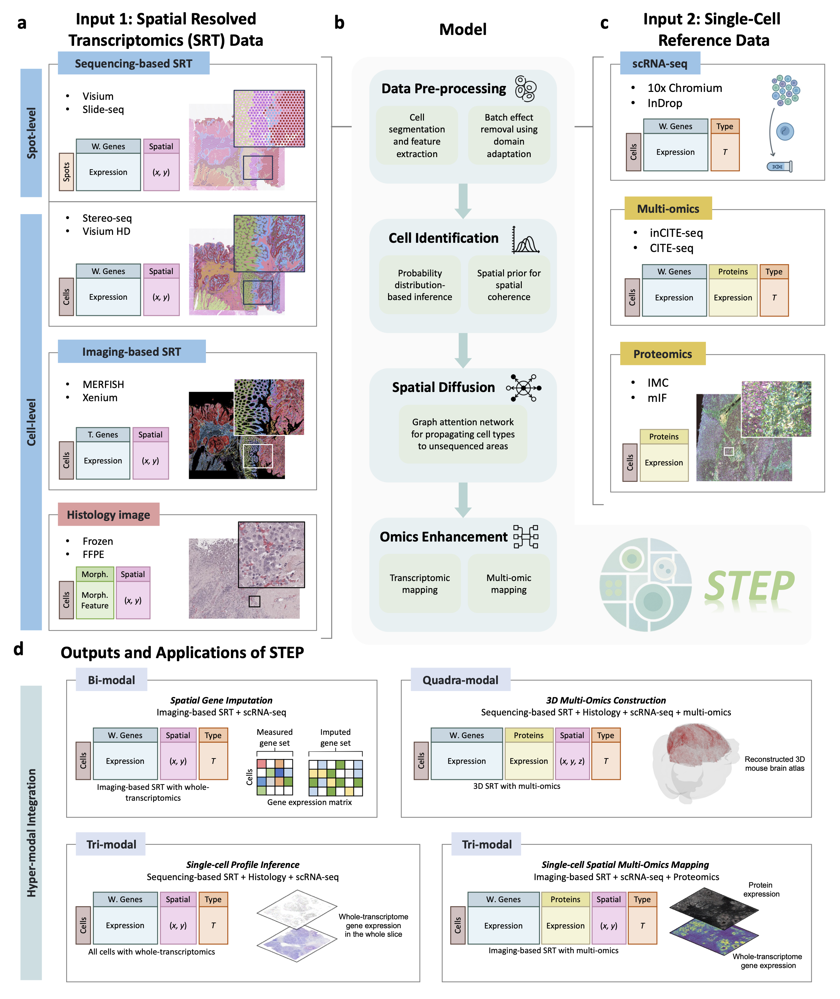

# STEP
#### Hyper-modal Integration Maps Whole-tissue Spatial Multi-omics at Single-cell Resolution

<div align="center">
    
</div>

**STEP** is a hybrid framework that combines probabilistic modeling and deep learning to jointly integrate histology, sequencing-based and imaging-based spatial transcriptomics, and single-cell reference data. It can infer missing modalities, enhance resolution for sequencing-based SRT to single-cell level, expand imaging-based SRT to whole-transcriptome profiles, and stitch multiple sections into spatial multi-omics atlases. STEP further enables tri- and quadra-modal integration to build 2D and 3D, single-cell–resolution spatial maps in a cost-efficient manner.

## Nuclei Segmentation
### [StarDist](https://github.com/stardist/stardist): Annotating with QuPath (2D) 

1. Install [QuPath](https://qupath.github.io/)
2. Create a new project (`File -> Project...-> Create project`) and add your raw images
3. Run [Segmentation/nucleifeatures.groovy](./Segmentation/nucleifeatures.groovy) to annotate nuclei/objects
4. Export the annotations (`File -> Export objects as GeoJSON`)

### [CLAM](https://github.com/mahmoodlab/CLAM): Basic, Fully Automated Run
``` python
python create_patches_fp.py --source DATA_DIRECTORY --save_dir RESULTS_DIRECTORY --patch_size 256 --seg --patch --stitch 
```
The patches folder in RESULTS_DIRECTORY contains arrays of extracted tissue patches from each slide (one .h5 file per slide, where each entry corresponds to the coordinates of the top-left corner of a patch). **Patches can be used to select cells within a tissue.**

## Running the Code
### Installation
Assuming that you have installed PyTorch and TorchVision, if not, please follow the [officiall instruction](https://pytorch.org/) to install them firstly. Similarly, torch_sparse can refer to the [website](https://pypi.org/project/torch-sparse/) to install the version corresponding to PyTorch.
Intall the dependencies using cmd:
``` shell
$ git clone https://github.com/childishHU/STEP.git
$ cd STEP
$ conda create -n STEP python=3.10
$ conda activate STEP
$ pip install -r requirements.txt
```

### Data Preprocessing
``` python
from STEP import run
run.ExtractFeatures(    
    tissue=tissue,
    out_dir=out_dir,
    ST_Data=ST_Data,
    Img_Data=Img_Data,
    CLAM_Data=CLAM_Data,
    Json_Data=Json_Data
)
```
**Input**

- tissue : Tissue name (e.g. PDAC, Human_Breast_Cancer)
- out_dir : Output directory
- ST_Data : Path to SRT data (.h5ad)
- Img_Data : Path to raw H&E stained image  (.tif/.tiff)
- CLAM_Data : Path to the CLAM output (.h5) containing histology foreground
- Json_Data : Path to the QuPath output (.geojson) containing morphology features

**Output**

- nuclei_segmentation.png : Visualization of nuclei segmentation results
- sp_adata_ef.h5ad : Preprocessed SRT data for cell identification with morphology features integrated into `.uns` under the key `features`
- logs.log : Runtime log recording each processing step, optimization progress, and data format information

### Cell Identification & Spatial Diffusion
``` python
from STEP import run
import os
run.CellIdentification(
    tissue=tissue,
    out_dir=out_dir,
    ST_Data=os.path.join(out_dir, tissue, 'sp_adata_ef.h5ad'),
    SC_Data=SC_Data,
    cell_class_column=cell_class_column,
    device=device
)
```
**Input**

- tissue : Tissue name (e.g. PDAC, Human_Breast_Cancer)
- out_dir : Output directory
- ST_Data : Path to the preprocessed SRT data with morphology features
- SC_Data : Path to single-cell reference data
- cell_class_column : Cell class label column in single-cell reference data
- device : Computing device used for running the model

**Output**

- AllCellTypeLabel_nu.csv : Cell types of all cells across the whole histological image (*sequening-based only*)
- CellTypeLabel_nu.csv : Cell types of cells within the sequenced spots
- Genes_factors.csv : Relationships between genes and morphological features (*sequening-based only*)
- GAT.pth : Trained Graph Attention Network model (*sequening-based only*)
- model.pth : Trained Conditional Variational Autoencoder model

### Omics Enhancement
``` python
from STEP import run
import os
run.GeneEnhancement(
    tissue=tissue,
    out_dir=out_dir,
    ST_Data=os.path.join(out_dir, tissue, 'sp_adata_ef.h5ad'),
    SC_Data=SC_Data,
    cell_class_column=cell_class_column
)
```
**Input**

- tissue : Tissue name (e.g. PDAC, Human_Breast_Cancer)
- out_dir : Output directory
- ST_Data : Path to the preprocessed SRT data with morphology features
- SC_Data : Path to single-cell reference data
- cell_class_column : Cell class label column in single-cell reference data

**Output**

- AllGENE.h5ad : Whole-transcriptomics at single-cell resolution

## File Topology
After completing all the steps, your project directory will have the following structure:
``` sh
out_dir
└── tissue
    ├── AllCellTypeLabel_nu.csv      # Predicted cell-type labels for all cells
    ├── AllGENE.h5ad                 # Processed AnnData object containing all genes at single-cell resolution
    ├── nuclei_segmentation.png      # Visualization of nuclei segmentation results
    ├── CellTypeLabel_nu.csv         # Predicted cell-type labels for cells within spatial spots
    ├── estemated_all_ct_label.png   # Visualization of predicted labels for all cell types
    ├── estemated_ct_label.png       # Visualization of predicted labels for cell types within spatial spots
    ├── Genes_factors.csv            # Relationships between morphological features and gene expression
    ├── InitProp.pickle              # Cached intermediate results used for warm-up / faster re-runs
    ├── logs.log                     # Training and inference log file
    ├── model
    │   ├── GAT.pth                  # Trained GAT (Graph Attention Network) weights
    │   ├── model.pth                # Trained CVAE (Conditional Variational Autoencoder) weights
    │   └── train_loss.png           # Training loss curve of the CVAE model
    └── sp_adata_ef.h5ad             # Original spatial AnnData object with expression and morphological features
```
## Tutorials
| Applications    | Files  |
|---------------------|-------------------------------------------------------------|
| STEP elucidates cellular heterogeneity and single-cell spatial gene expression using histological cellular features    |   [PDAC.ipynb](./PDAC.ipynb)        |
| STEP recovers spatial gene expression in unsequenced tissue to reveal the tumor heterogeneity          |   [10xVisium_HumanBreastCancer.ipynb](./10xVisium_HumanBreastCancer.ipynb)       |  
| Tri-modal integration achieves spatial multi-omics mapping at single-cell resolution       |   [Xenium_HumanBreastCancer_Multi-omics.ipynb](./Xenium_HumanBreastCancer_Multi-omics.ipynb)        |
| Quadra-modal integration provides a cost-effective solution for 3D multi-omics mapping at single-cell resolution       |   [3D_MouseBrain_Atlas.ipynb](./3D_MouseBrain_Atlas.ipynb)        |


## License

If there are any questions, Please contact
[Zheqi Hu](mailto:23S151128@stu.hit.edu.cn) and
[Yongbing Zhang](mailto:ybzhang08@hit.edu.cn).