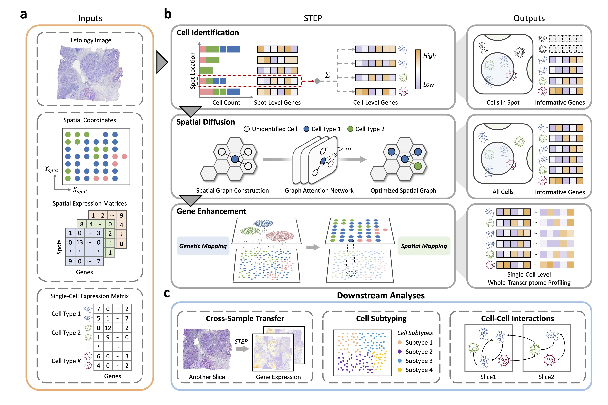

# STEP: Deciphering Spatial Atlas at Single-Cell Level with Whole-Transcriptome Coverage

[[Preprint]](https://www.biorxiv.org/content/10.1101/2024.11.22.624797v1)


**Abstract**: Recent advances in spatial transcriptomics have revolutionized our understanding of tissue spatial architecture and biological processes. However, many of these technologies face significant challenges in achieving either single-cell resolution or whole-transcriptome profiling, hindering their capacity to fully elucidate intercellular interactions and the tissue microenvironment. To address these limitations, we present STEP, a hybrid framework that synergistically integrates probabilistic models with deep learning techniques for spatial transcriptome analysis. Through innovations in model and algorithm design, STEP not only enhances sequencing-based spatial transcriptome data to single-cell resolution but accurately infers transcriptome-wide expression levels for imaging-based spatial transcriptomic. By leveraging the nuclear features extracted from histological images, STEP achieves precise predictions of cell type and gene expression and effectively diffuses the discriminative ability to serial sections for modeling solid tissue landscapes. The capability is particularly advantageous for analyzing cells with distinctive characteristics, such as cancer cells, enabling cross-sample inference. In addition, STEP simulates intercellular communication through a spatially resolved cell-cell interaction network, uncovering intrinsic biological processes. Overall, STEP equips researchers with a powerful tool for understanding biological functions and unveiling spatial gene expression patterns, paving the way for advancements in spatial transcriptomics research.


<!-- Insert a pipeline of your algorithm here if got one -->
<p align="center">
     <br />
    Fig.1: Overview of STEP. STEP is a multi-modal integration architecture tailored for whole-transcriptome expression at the single-cell level. a Data collection and pre-processing. b Main workflow of STEP, consisting of three key stages: Cell Identification, Spatial Diffusion, and Gene Enhancement. c Downstream analyses enabled by STEP, including Cross-Sample Transfer, Cell Subtyping, and Cell-Cell Interactions.
</p>

---

Recent updates:
- the tutorial and related data are coming soon!
- 24/11/26: codes are live
- 24/11/24: paper is live
- 24/11/22: release STEP 


*On updating. Stay tuned.*
## Running the Code
### Installation
``` shell
$ git clone https://github.com/childishHU/STEP.git
$ cd STEP
$ conda create -n STEP python=3.10
$ conda activate STEP
$ pip install -r requirements.txt
```
### Nucleus Segmentation
```
python  Extract_Features.py --tissue cortex --out_dir ./output --ST_Data ./data/Visium_MouseBrain_Cortex_section2.h5ad --Img_Data ./data/V1_Mouse_Brain_Sagittal_Anterior_Section_2_image.tif  --CLAM_Data ./data/V1_Mouse_Brain_Sagittal_Anterior_Section_2_image.h5 --Json_Data ./data/V1_Mouse_Brain_Sagittal_Anterior_Section_2_image.geojson --part True
```
Inputs

- --out_dir: output directory
- --tissue: output sub-directory
- --ST_Data: ST data file path
- --Img_Data: H&E stained image data file path
- --CLAM_Data: Foreground region extracted by CLAM file path
- --Json_Data: StarDist segmentation result file path
- --part: Does it provide RoI (Region of Interest)

Outputs

- Preprocessed ST data for Nucleus Segmentation: sp_adata_ef.h5ad (**features** that contains morphological features of segmented cells will be added to .uns)
### Identification & Diffusion
Coming Soon
### Gene enhancement
Coming Soon
## Acknowledgements
Some parts of codes in this repo are adapted from the following amazing works. We thank the authors and developers for their selfless contributions. 

- [RCTD](https://github.com/dmcable/RCTD): a typical work for cell-type deconvolution.
- [SpatialScope](https://github.com/YangLabHKUST/SpatialScope): our STEP fully exploits the nuclear features.
- [StarDist](https://github.com/stardist/stardist): incoporated with QuPath for nuclei segmentation.
- [QuPath](https://github.com/qupath/qupath/releases/tag/v0.6.0-rc3): adapted for nuclear feature extraction.
- [CLAM](https://github.com/mahmoodlab/CLAM): used for extracting tissue foreground.
- [Fast_WSI_color_norm](https://github.com/MEDAL-IITB/Fast_WSI_Color_Norm): used for WSI color normalization.


## Citation

If you find this work helps your research, please consider citing our paper:
```txt
@article{hu2024step,
  title={STEP: Deciphering Spatial Atlas at Single-Cell Level with Whole-Transcriptome Coverage},
  author={Hu, Zheqi and Zhu, Zirui and Cai, Linghan and Zhan, Yangen and others},
  journal={bioRxiv},
  pages={2024--11},
  year={2024},
  publisher={Cold Spring Harbor Laboratory}
}
```
## License
Distributed under the Apache 2.0 License. See LICENSE for more information.
